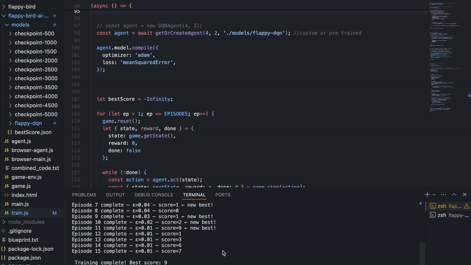
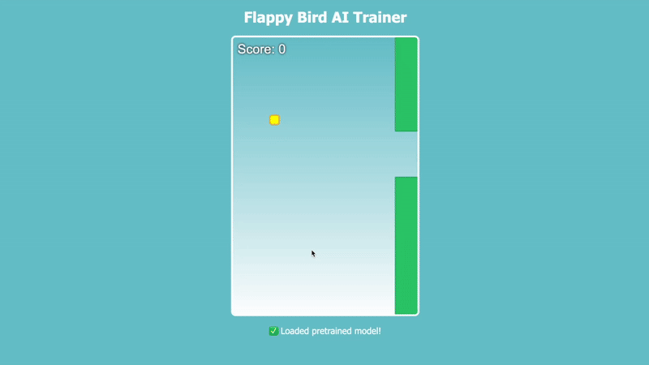

flappy bird AI w/ TensorFlowJS Reinforcement Learning (Q-learning) 

inspired by: https://flappybird-ai.netlify.app/ 
credits to https://github.com/nebez/floppybird for game copy 

Medium Article: https://medium.com/@ks2496/teaching-a-bird-to-fly-training-flappy-bird-ai-in-the-browser-with-tensorflow-d8aa90543e2c 

### I: CLI-Based Training (50 Episodes, 5k Memory)
Self-learning Flappy Bird AI built with TensorFlow.js and Deep Q-Learning.
The agent trains from scratch in a Node.js environment, improving through trial and error over 50 episodes using a memory buffer of 5,000 game states.

### II: In-Browser Demo
The trained model is loaded directly into the browser, where it plays in real-time on a canvas using only JavaScript and TensorFlow.js — no backend required.
Includes real-time visualization of gameplay, score, and optional live training.

